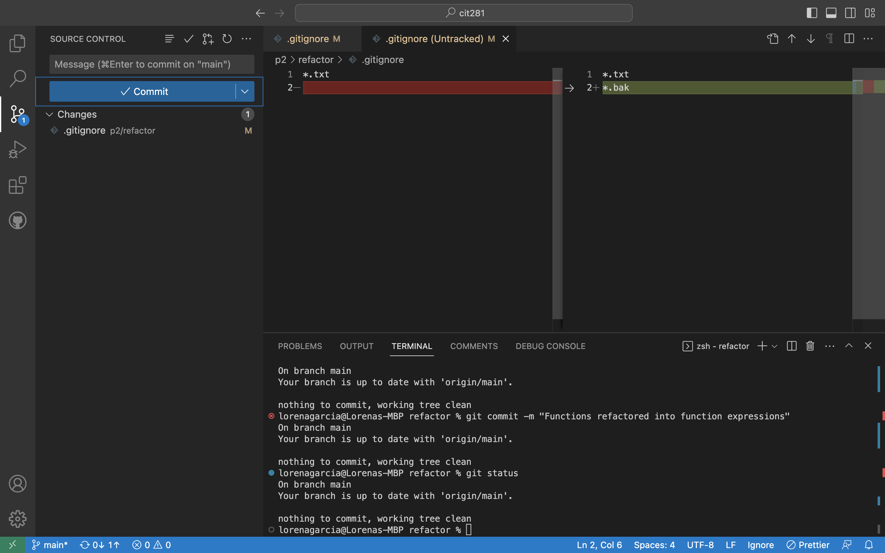

In this project, I had the opportunity to gain experience using git through both the command line interface (CLI) of my operating system and the Source Control features in Visual Studio Code. 
I learned how to create and manage a git repository using the CLI, as well as utilize git within VSCode! 

Within this project I worked with a non-web server called Node.js. I was able to continue to practice refactoring JavaScript code, which involves restructuring and optimizing the code to improve its readability, efficiency, and maintainability. 
I also learned for the first time on how to create and utilize a .gitignore file to exclude certain files or directories from being tracked by git. The following is a submission image that demonstrates the diff screen method: 

This project helped enhance my understanding and proficiency in using git, executing Node.js JavaScript code, and refactoring JavaScript programs.
